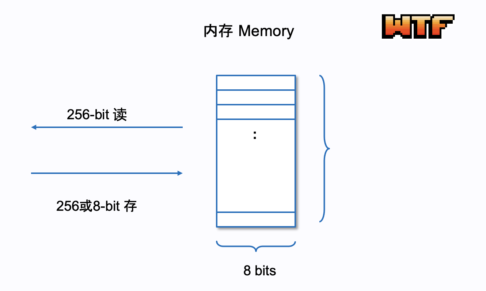

# WTF Opcodes极简入门: 6. 位级指令

我最近在重新学以太坊opcodes，也写一个“WTF Opcodes极简入门”，供小白们使用。

推特：[@0xAA_Science](https://twitter.com/0xAA_Science)

社区：[Discord](https://discord.gg/5akcruXrsk)｜[微信群](https://docs.google.com/forms/d/e/1FAIpQLSe4KGT8Sh6sJ7hedQRuIYirOoZK_85miz3dw7vA1-YjodgJ-A/viewform?usp=sf_link)｜[官网 wtf.academy](https://wtf.academy)

所有代码和教程开源在github: [github.com/WTFAcademy/WTF-Opcodes](https://github.com/WTFAcademy/WTF-Opcodes)

-----

在这一讲，我们将介绍EVM中用于内存（Memory）操作的3个指令，包括`MSTORE`，`MSTORE8`，和`MLOAD`。我们将在用Python写的极简版EVM中添加对这些操作的支持。

## EVM中的内存

我们在[第一讲](https://github.com/WTFAcademy/WTF-Opcodes/blob/main/01_HelloOpcodes/readme.md)介绍了EVM的内存，它是一个线性寻址存储器，类似一个动态的字节数组，可以根据需求动态扩展。它的另一个特点就是易失性，交易结束时所有数据都会被清零。它支持以8或256 bit写入（`MSTORE8`/`MSTORE`），但只支持以256 bit取（`MLOAD`）。



我们可以用Python内置的`bytearray`来代表内存：

```python
def __init__(self, code):
    self.code = code
    self.pc = 0
    self.stack = []
    self.memory = bytearray()  # 内存初始化为空
```

内存的读写比存储（Storage）的读写要便宜的多，每次读写有固定费用3 gas，另外如果首次访问了新的内存位置（内存拓展），则需要付额外的费用（由当前偏移量和历史最大偏移量决定），计算方法见[链接](https://www.evm.codes/about#accesssets)。

## MSTORE （内存写）

`MSTORE`指令用于将一个256位（32字节）的值存储到内存中。它从堆栈中弹出两个元素，第一个元素为内存的地址（偏移量 offset），第二个元素为存储的值（value）。操作码是`0x52`，gas消耗根据实际内存使用情况计算（3+X）。

```python
def mstore(self):
    if len(self.stack) < 2:
        raise Exception('Stack underflow')
    offset = self.stack.pop()
    value = self.stack.pop()
    while len(self.memory) < offset + 32:
        self.memory.append(0) # 内存扩展
    self.memory[offset:offset+32] = value.to_bytes(32, 'big')
```

我们在`run()`函数中添加对`MSTORE`指令的处理：

```python
def run(self):
    while self.pc < len(self.code):
        op = self.next_instruction()

        # ... 其他指令的处理 ...

        elif op == MSTORE: # 处理MSTORE指令
            self.mstore()
```

现在，我们可以尝试运行一个包含`MSTORE`指令的字节码：`0x6002602052`（PUSH1 2 PUSH1 0x20 MSTORE）。这个字节码将`2`和`0x20`（32）推入堆栈，然后进行`MSTORE`，将`2`存到偏移量为`0x20`的地方。

```python
# MSTORE
code = b"\x60\x02\x60\x20\x52"
evm = EVM(code)
evm.run()
print(evm.memory[0x20:0x40])  
# 输出: [0, 0, 0, ..., 0, 2]
```

## MSTORE8 （内存8位写）

`MSTORE8`指令用于将一个8位（1字节）的值存储到内存中。与`MSTORE`类似，但只使用最低8位。操作码是`0x53`，gas消耗根据实际内存使用情况计算（3+X）。

```python
def mstore8(self):
    if len(self.stack) < 2:
        raise Exception('Stack underflow')
    offset = self.stack.pop()
    value = self.stack.pop()
    while len(self.memory) < offset + 32:
        self.memory.append(0) # 内存扩展
    self.memory[offset] = value & 0xFF # 取最低有效字节
```

我们在`run()`函数中添加对`MSTORE8`指令的处理：

```python
elif op == MSTORE8: # 处理MSTORE8指令
    self.mstore8()
```

现在，我们可以尝试运行一个包含`MSTORE8`指令的字节码：`0x6002602053`（PUSH1 2 PUSH1 0x20 MSTORE8）。这个字节码将`2`和`0x20`（32）推入堆栈，然后进行`MSTORE8`，将`2`存到偏移量为`0x20`的地方。

```python
# MSTORE8
code = b"\x60\x02\x60\x20\x53"
evm = EVM(code)
evm.run()
print(evm.memory[0x20:0x40])  
# 输出: [2, 0, 0, ..., 0, 0]
```

## MLOAD （内存读）

`MLOAD`指令从内存中加载一个256位的值并推入堆栈。它从堆栈中弹出一个元素，从该元素表示的内存地址中加载32字节，并将其推入堆栈。操作码是`0x51`，gas消耗根据实际内存使用情况计算（3+X）。

```python
def mload(self):
    if len(self.stack) < 1:
        raise Exception('Stack underflow')
    offset = self.stack.pop()
    while len(self.memory) < offset + 32:
        self.memory.append(0) # 内存扩展
    value = int.from_bytes(self.memory[offset:offset+32], 'big')
    self.stack.append(value)
```

我们在`run()`函数中添加对`MLOAD`指令的处理：

```python
elif op == MLOAD: 
    self.mload()
```

现在，我们可以尝试运行一个包含`MLOAD`指令的字节码：`0x6002602052602051`（PUSH1 2 PUSH1 0x20 MSTORE PUSH1 0x20 MLOAD）。这个字节码将`2`和`0x20`（32）推入堆栈，然后进行`MSTORE`，将`2`存到偏移量为`0x20`的地方；然后将`0x20`推入堆栈，然后进行`MLOAD`，将刚才存储在内存的值读取出来。

```python
# MSTORE
code = b"\x60\x02\x60\x20\x52\x60\x20\x51"
evm = EVM(code)
evm.run()
print(evm.memory[0x20:0x40])  
# 输出: [0, 0, 0, ..., 0, 2]
print(evm.stack)  
# output: [2]
```

## 总结

这一讲，我们介绍了EVM中的内存操作指令，并在极简版EVM中添加了对它们的支持。这些操作允许我们在EVM的内存中存储和检索值，为更复杂的合约逻辑提供基础。

课后习题: 写出`0x6002602053602051`对应的指令形式，并给出运行后的堆栈和内存状态。
